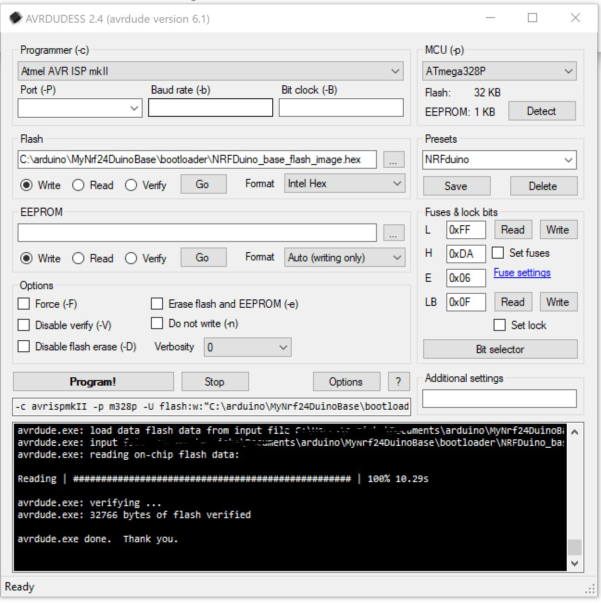

## Bootloader

This directory contains fallowing files:

- MYSBL-1.3-pre_NRFduino_8MHz.hex - a precompiled Mysensors Bootloader RF24 Version 1.3-pre modified to support this device
- NRFDuino_full_flash_image_orig.hex - a full image of device flash content from supplier, can be used to reset / recover a device
- NRFDuino_base_flash_image.hex - a full image containing the Mysensors Bootloader and the Firmware compiled with this Project

---

## How To Flash it

For burning bootloaders to arduino based devices you will find some documentation on the internet. So i will skip them here.

For the both full images you also need a ISP and avrdude to flash this to the device. I'm using AVRDUDESS as gui. Works great.

Before you try to flash something, try to detect the device. So you can be sure the communication is ready for flushing. Also is recommended to read the fuses before burning. Then simply select the file and klick on Programm.

The Fuses for the NRF24Duino by default:
- Low - 0xFF
- High - 0xDA
- Extended - 0x06

Lock Bit - 0x0F
